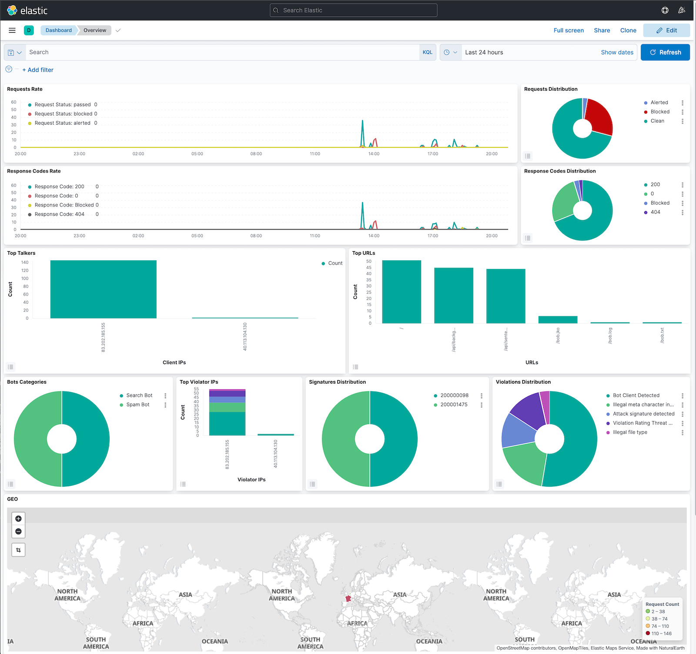

# DevSecOps with Nginx App Protect and F5XC
Repo to simplify and learn DevSecOps with Nginx App Protect

You can find a full lab guide here : https://clouddocs.f5.com/training/community/devsecops-azure-workshop/html/

# Pre-Reqs

* Azure AKS up and running
* A private container repo (Azure Container registry for instance)
* Kubeconfig file
* Kubectl CLI and/or k8s tools like Lens
* Nginx App Protect license
* Terraform
* Docker desktop or CE

# 1. Clone this repo in your own GitHub

* Clone or Fork the repo in order to have your own repo in your own GitHub
* Create a `dev` branch in order to do not modify the main. 
* Move to the `dev` branch. You will work on the `dev` branch.

# 2. Deploy Sentence App in your AKS

## Deploy the Sentence App microservice

The manifest `aks-sentence-deployment.yaml` will deploy the different microservices. As reminder, the Sentence Application display a sentence with 4 words coming from 4 microservices (more information here https://github.com/MattDierick/sentence-generator-app)

## Deploy the frontend microservice

The manifest `aks-sentence-deployment-nginx-nolb.yaml` will deploy the frontend service (base on nginx webserver). As you can notice, this service is not yet exposed. The associated service is a ClusterIP type.

# 3. Build the Nginx App Protect docker image

In order to expose the Sentence Application, we will deploy a NAP as a POD (not Ingress) in order to expose and protect the Sentence Application.

The docker image will stay static. It means, we don't want to re-build a new image everytime a config update is done. It means configuration files will be imported from a source of truth (Github).
A configuration update is:

* A new application exposed (nginx.conf)
* A NAP policy update (signature, violation exception ...)

**Prepare your Azure Container Registry**

* Create an Azure Container Registry as private (premium offering)
* Interconnect your laptop (the one with Docker running) with your private Azure repo

```
az login
az account set --subscription <subscription-ID>
TOKEN=$(az acr login --name <your_registry> --expose-token --output tsv --query accessToken)
docker login <your_registry>.azurecr.io --username 00000000-0000-0000-0000-000000000000 --password $TOKEN
```

* Collect the outcomes (username and password) from the Azure Portal (access keys section), and run the next command to create the k8s secret

```
kubectl create secret docker-registry secret-azure-acr --namespace <your-namespace> --docker-server=<your_registry>.azurecr.io --docker-username=<username-generated> --docker-password=<password-generated>
```

**Steps**

* In /nginx-nap directory, copy your nginx-repo.crt and nginx-repo.key
* Modifty the `entrypoint.sh` script so it points to your GitHub repo 
* Build your docker image

```
DOCKER_BUILDKIT=1 docker build --no-cache --secret id=nginx-crt,src=nginx-repo.crt --secret id=nginx-key,src=nginx-repo.key -t <your_registry>.azurecr.io/nginx/nap:v1.0 .
```

* Push your NAP image into your private registry

```
docker push <your_registry>.azurecr.io/nginx/nap:v1.0
```

# 4. Deploy the NAP in front of the Sentence App

It is time to expose and protect Sentence Application. To do so, deploy NAP in your AKS and route traffic to the right services.

* As a reminder (kubectl get services), the FrontEnd service is called `sentence-frontend-nginx` and listening on port `80`
* In your Github repo, check the files
    * nginx-nap/etc/nginx/upstream.d/http-sentence.conf -> this is the upstream (the sentence-frontend-nginx service)
    * nginx-nap/etc/nginx/vhosts.d/http-sentence.conf -> this is the vhosts (choose any fqdn for your lab)

* We will have a look later on the NAP policy tree

## Deploy the NAP in your AKS via Terraform

In order to be idempotent and immutable, we will use Terraform for Config as Code, and Infra as Code.

**Idempotent** : The system configurations for infrastructures remain consistent so that you get the same result each time they are used

**Immutable** : An application or service is effectively redeployed each time any change occurs

Run the Terraform in order to deploy the NAP in your AKS. `Modify` the plan accordingly so that the image is pulled from your private repository (line 36), and also point to your `kubeconfig context` (line 3)

```
terraform init
terraform plan
terraform apply
```

# 5. Test your NAP

Now, you should see a new service as a Load Balancer (can take up to 5 min). The lastest manifest command created a service kind LB. Azure created an Azure LB witha a public IP Address.


* Modify you host file to point to this public IP address, and using the fqdn set in the vhost file.
* Example: vhost file refering to `sentence-test.emea.f5se.com` and public LB IP address is `20.223.49.15`


## Understand what happened

It is important to understand what happened when the NAP booted up. Look at the `entrypoint.sh` script. This script runs a boot time.
You can notice the NAP download all its configuration from GitHub

```
git clone --branch dev https://github.com/MattDierick/devsecops-nap.git /tmp/devsecops/
cp -r /tmp/devsecops/nginx-nap/etc/nginx/* /etc/nginx/
```

## Connect to ELK

If you have time, you can deploy your own ELK by following this guide : https://github.com/f5devcentral/f5-waf-elk-dashboards
To do so, run an Ubuntu VM in Azure with docker. Then run the docher-compose. Then modify the nginx-nap/etc/nginx/nap-files/logs/custom_log_format.json accordingly with the Azure LB public IP addess.

If you prefer, you can use an opened ELK running in Azure : http://40.113.104.130:5601/
Please provide with your source IP address in order to allow traffic from your location.



# 6. DevSecOps workflow

Having done, DevOps deployed their app and exposed this app thanks to a NAP.

Now, it is time for SecOps to `operate` the security in a modern environment. To do so, we will simulate a False Postive and a request from Business Unit to change the blocking page.

## Change blocking page

Business unit asked you to make the blocking page more custom. To do so, edit the `source of truth (Github)` to reflect this change.
Edit `nginx-nap/etc/nginx/nap-files/policies/custom-references/response-pages/response-pages.json` file as you want. Make this edit where you want:

* in GitHub directly
* in your laptop. Don't forget to commit changes in GitHub


If you are interested to understand the NAP Policy tree, please look at here : https://github.com/MattDierick/devsecops-nap/tree/main/nginx-nap/etc/nginx/nap-files/policies

This tree has been created by Jeppe. It represents a piece of the policy, up to you to complete it with more branches and settings.

## Rolling upgrade

As the source of truth is updated, it is time to tell to the infra to upgrade to the new config version. As reminder, we want something **immutable**. It means a new NAP pod will be deployed in AKS thanks to rolling upgrade (new one deployed and old one destroyed)

To do so, edit your Terraform plan by changing the version (line 30). Increment it as you want, it does not matter. The change matters.
And `apply` the new plan.

```
terraform apply
```

Look at your AKS pods (`kubectl get pods`), and you should see 1 new NAP pod booting.
After few seconds, the new NAP POD will handle the traffic.

**Test your new deployment** : send an attack and check if you can see your new custom blocking page.

## Manage False Positive in a DevSecOps world

* Send this attack : `<my_fqdn>?a=<script>`
* This will generate a XSS violation with 2 signatures match

    * Sig 200001475 and 200000098
    * You can see the violation log in your NAP pod (/var/log/app-protect/security.log)

* DevOps don't want to make any change, and SecOps don't want to deal with AKS
* As a SecOps, modify the policy to disable those 2 signatures

    * In nginx-nap/etc/nginx/nap-files/policies/custom-references/signatures/modifications.json, disable the 2 signatures

    ```
        {
            "modifications": [
                {
                    "entityChanges": {
                        "enabled": false
                    },
                    "entity": {
                        "signatureId": 200001475
                    },
                    "entityType": "signature",
                    "action": "add-or-update"
                },
                {
                    "entityChanges": {
                        "enabled": false
                    },
                    "entity": {
                        "signatureId": 200000098
                    },
                    "entityType": "signature",
                    "action": "add-or-update"
                }
            ]
        }
    ```

* Commit your change in GitHub
* Run a rolling upgrade (via Terraform - increase the version)

* Send the attack again, it should pass.

# 7. Deploy F5XC WAAP in front of the AKS infrastructure

The last step consists of :

* Deploying a F5XC node in front of the AKS
* Discover AKS services via F5XC Service Discovery
* Create a F5XC LB with a WAAP policy (DDoS and Advanced Bot) - WAF already managed by NAP
* Expose the Sentence application on the 20ish F5XC pops


# Extra-steps to setup an ECK in your AKS

* Go to k8s-deployment/ECK directory and execute all the manifest in this order

``` 
kubect apply -f all-in-one.yaml
kubect apply -f elasticsearch.yaml
kubectl create secret generic kibana-saved-objects-encrypted-key --from-literal=xpack.encryptedSavedObjects.encryptionKey=12345678901234567890123456789012
kubectl apply -f kibana.yaml
kubectl apply -f logstash-cm.yaml
kubectl apply -f logstash.yaml
kubectl apply -f logstash-service.yaml
```

* Get your ECK password 

```
echo $(kubectl get secret elasticsearch-es-elastic-user -o go-template='{{.data.elastic | base64decode}}')
```

* Push the NAP Dashboard into ECK (change the password value with your password). But first, find your Logstash-lb public IP address

```
❯ kubectl get services
NAME                         TYPE           CLUSTER-IP     EXTERNAL-IP      PORT(S)                          AGE
elasticsearch-es-default     ClusterIP      None           <none>           <none>                           107m
elasticsearch-es-http        LoadBalancer   10.0.28.236    20.223.17.201    9200:31190/TCP                   107m
elasticsearch-es-transport   ClusterIP      None           <none>           9300/TCP                         107m
kibana-kb-http               LoadBalancer   10.0.253.12    20.223.250.186   443:31235/TCP                    104m
kubernetes                   ClusterIP      10.0.0.1       <none>           443/TCP                          391d
logstash                     ClusterIP      10.0.151.251   <none>           25826/TCP,5044/TCP               89m
logstash-lb                  LoadBalancer   10.0.76.75     20.123.125.224   25826:32099/TCP,5044:31063/TCP   78m
```

```
KIBANA_URL=https://<your-public-ip-kibana-lb>
jq -s . overview-dashboard-bot.ndjson | jq '{"objects": . }' | \
    curl -k --location --user elastic:<your-password> --request POST "$KIBANA_URL/api/kibana/dashboards/import" \
    --header 'kbn-xsrf: true' \
    --header 'Content-Type: text/plain' -d @- \
    | jq
```